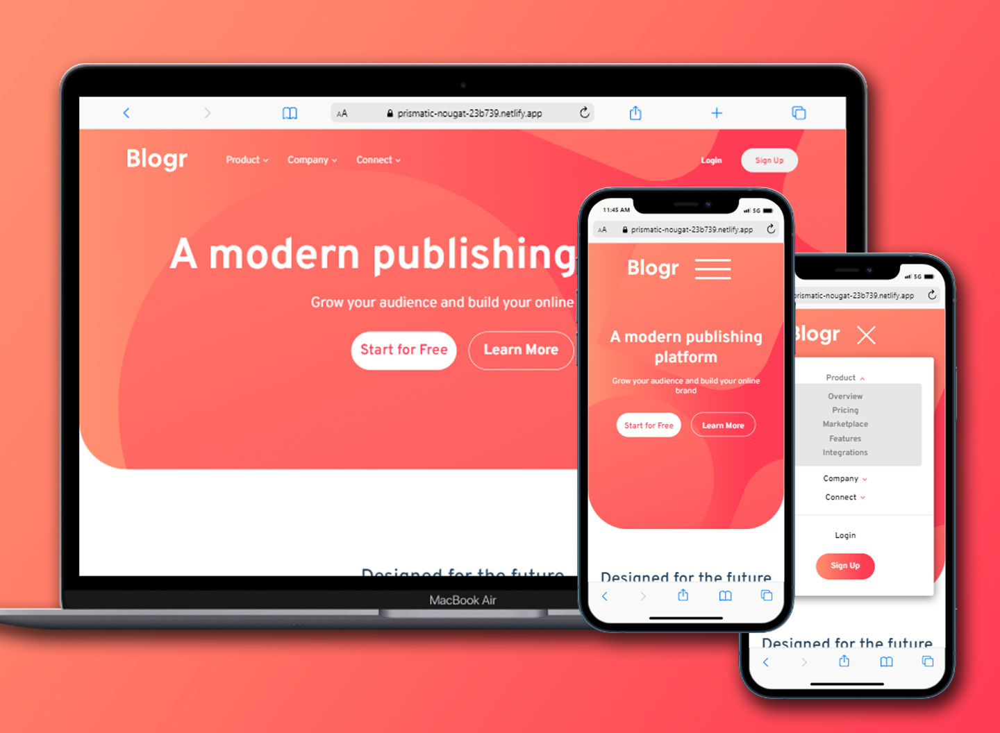

# Frontend Mentor - Blogr landing page solution

This is a solution to the [Blogr landing page challenge on Frontend Mentor](https://www.frontendmentor.io/challenges/blogr-landing-page-EX2RLAApP). Frontend Mentor challenges help you improve your coding skills by building realistic projects. 

## Overview

### Built with

- HTML5
- SCSS
  > Why useing scss?
  > 
  > because will use nesting

### What I learned

Use scss and nesting, make hamburger menu & dropdown without js but just use css only.

### Screenshot

My Skills

Original Design

### Links

- Solution URL: [Solution](https://www.frontendmentor.io/solutions/blogr-landing-page-LgfhqBn46B)
- Live Site URL: [Live Site](https://zachtix-fem-blogr.netlify.app/)
